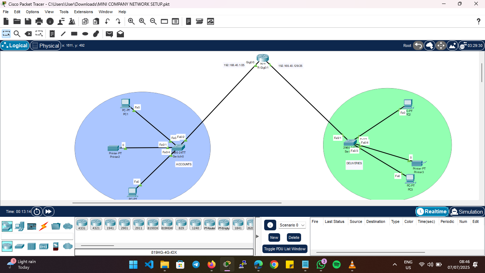

# 🏢 Mini Company Network Setup - Cisco Packet Tracer

## 📘 Project Overview

This project simulates a **basic small business network** using **Cisco Packet Tracer**, comprising two departments: `ACCOUNTS` and `DELIVERIES`. Each department has its own subnet, connected via a central router. This setup includes:

- Multiple PCs and network printers  
- Two switches for departmental segmentation  
- A router for inter-departmental and external routing  
- Logical IP addressing and subnetting  
- Proper use of static routing to facilitate communication between departments  

## 🧠 Key Concepts Learned

Through building this network, I strengthened my practical understanding of:

- ✅ **Careful IP Address Planning**: Used structured IP addressing (e.g., `192.168.40.0/25`) to logically segment the departments and reduce broadcast traffic.  
- ✅ **Static Routing**: Configured static routes to ensure devices across different subnets could communicate.  
- ✅ **Switch and Router Configuration**: Applied basic switch and router setups (interface addressing, enabling ports).  
- ✅ **Network Segmentation**: Used switches to isolate traffic between `ACCOUNTS` and `DELIVERIES` for better security and performance.  
- ✅ **Troubleshooting Techniques**: Leveraged Packet Tracer’s simulation tools to test connectivity and debug issues such as misconfigured IPs or cable types.  

## 🔧 Network Components

- **Router**: Cisco 2911  
- **Switches**: Cisco 2960  
- **Devices**: PCs, Printers  
- **Connection Types**: Copper Straight-through and Cross-over cables  
- **IP Addressing Scheme**:
  - `192.168.40.0/25` – ACCOUNTS
  - `192.168.40.128/25` – DELIVERIES  

## ✨ Skills Development Journey

This project is part of my **continuous journey into networking and cybersecurity**. Building this network helped bridge theory and practice—especially in understanding how devices interact on a layered OSI model. It’s a foundational step as I advance toward more complex network configurations and security implementations.

## 📁 Files

- `MINI COMPANY NETWORK SETUP.pkt` – Main Packet Tracer project file  
- `Screenshot.png` – Network topology image  
- `README.md` – This documentation  

## 🔍 Next Steps

- Introduce VLANs for better segmentation  
- Add DHCP server configuration for dynamic IP assignment  
- Simulate firewall rules and ACLs to enhance security  
